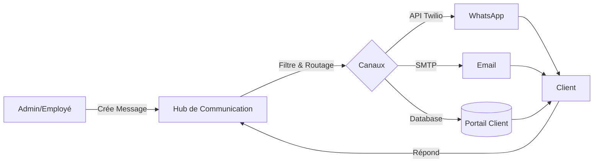

# Proposition : Système de Communication Multicanale Externe

Ce document présente une stratégie complète pour étendre notre système de communication interne actuel aux clients, permettant une collaboration transparente sur les tâches et diligences.

## 1. Idées Concrètes de Communication Multicanale

Pour garantir que le client reçoive l'information là où il est le plus actif, nous proposons les canaux suivants :

*   **Portail Client Interactif (Web/Mobile) :** 
    *   Fil de discussion dédié pour chaque tâche/diligence.
    *   Possibilité pour le client de poser des questions, valider des étapes ou uploader des documents.
*   **WhatsApp Transactionnel (via Twilio) :**
    *   Notifications automatiques lors d'un changement de statut de tâche.
    *   Résumé hebdomadaire des diligences en cours.
    *   *Quick Reply* : Permettre au client de répondre "Approuvé" directement sur WhatsApp pour valider une étape.
*   **Emailing Intelligent :**
    *   Notifications de nouveaux messages avec un lien direct vers la tâche dans le portail.
    *   Envoi périodique de rapports d'état (PDF) générés automatiquement.
*   **Notifications Push (Mobile) & In-App :**
    *   Alertes en temps réel sur le téléphone du client pour les urgences fiscales ou sociales.
*   **SMS de Rappel :**
    *   Canal de secours pour les échéances critiques si les autres canaux échouent.

---

## 2. Architecture du Système

### Flux de Communication

### Rôles et Permissions
| Rôle | Permissions |
| :--- | :--- |
| **Administrateur** | Voir tous les échanges, configurer les automates, auditer les logs. |
| **Employé** | Communiquer uniquement sur les tâches qui lui sont assignées. |
| **Client** | Voir uniquement les échanges liés à ses propres tâches/diligences. |

### Sécurité et Traçabilité
*   **Centralisation** : Tous les messages (WhatsApp, Email, Chat) sont stockés dans la table `users_chat` ou `task_notes` avec un flag `channel` et `task_id` pour une traçabilité totale.
*   **Confidentialité** : Utilisation de Scopes Laravel pour garantir qu'un client ne puisse jamais accéder aux données d'un autre (déjà initié avec l'API JWT).
*   **Séparation Interne/Externe** : Utilisation du flag `is_client_visible` pour distinguer les notes de travail (équipe seulement) des messages de communication (visibles par le client).
*   **Archivage** : Conservation de l'historique complet pour preuve en cas de litige.

---

## 3. Éviter les conflits Interne vs Externe

Pour répondre à votre préoccupation sur le risque de mélange entre les échanges d'équipe et les messages clients, nous appliquerons les règles suivantes :

1.  **Étanchéité des Données** : Les notes internes existantes garderont le flag `is_client_visible = false`. Elles ne seront **jamais** envoyées par WhatsApp ni affichées sur le portail client.
2.  **Interface Séparée** : Dans la fiche tâche, nous aurons deux onglets distincts :
    *   **"Notes d'équipe"** : Pour la stratégie interne.
    *   **"Communication Client"** : Pour les échanges multicanaux avec le client.
3.  **Triggers Sécurisés** : Seuls les messages créés dans l'onglet "Communication Client" déclencheront un envoi WhatsApp ou Email.

---

## 4. Plan d'Implémentation Détaillé

### Étape 1 : Consolidation de la Base de Données (Semaine 1)
*   Finaliser les migrations pour lier les messages aux tâches (`task_id`) et définir les canaux (`channel`).
*   Ajouter des préférences de notification pour chaque client (ex: "Je préfère WhatsApp pour les urgences et Email pour les rapports").

### Étape 2 : Développement du Hub de Notification (Semaine 2)
*   Création d'un service `CommunicationHub` qui centralise l'envoi vers `Notification::send()`.
*   Implémentation de nouveaux canaux Laravel (déjà commencé avec `WhatsAppChannel`).

### Étape 3 : Interface Client "Espace Échanges" (Semaine 3)
*   Développement de la vue "Discussion" dans l'API/Portail client.
*   Intégration de WebSockets (Pusher/Soketi) pour le chat en temps réel.

### Étape 4 : Automatisation et Triggers (Semaine 4)
*   Configuration de *Webhooks* Twilio pour recevoir les réponses WhatsApp.
*   Mise en place de *Listenner* Laravel pour envoyer des notifications automatiques au changement de statut d'une tâche.

---

## 4. Outils et Technologies Recommandés

*   **Backend** : Laravel 10+ (Architecture actuelle).
*   **Passerelle WhatsApp/SMS** : **Twilio** (Robuste, API riche).
*   **Temps Réel** : **Soketi** (Auto-hébergé, gratuit) ou **Pusher** (Cloud).
*   **Emailing** : **Amazon SES** ou **Mailgun** (Haute délivrabilité).
*   **Analyse** : **Laravel Pulse** pour monitorer les files d'attente d'envoi.

---

## 5. Analyse des Risques

| Risque | Impact | Atténuation |
| :--- | :--- | :--- |
| **Surcharge d'information** | Client agacé par trop de messages | Système de préférences de notification (Opt-in/Opt-out). |
| **Confidentialité** | Fuite de données entre clients | Tests unitaires stricts sur les `GlobalScopes` et `Policies`. |
| **Sécurité Twilio** | Coûts élevés si abus | Limites de débit (Rate Limiting) et validation des numéros. |
| **Accessibilité** | Client sans smartphone | Toujours doubler par un email et assurer la réactivité du portail web simple. |

---

## 6. Synthèse Comparatitve des Canaux

| Canal | Rapidité | Coût | Traçabilité | Adapté pour... |
| :--- | :--- | :--- | :--- | :--- |
| **Portail Client** | Haute | Nulle | Maximale | Documents, détails complexes. |
| **WhatsApp** | Instantanée | Faible | Bonne | Alertes, validations rapides. |
| **Email** | Moyenne | Nulle | Excellente | Rapports, archivage légal. |
| **SMS** | Instantanée | Moyenne | Basique | Urgences sans internet. |

---
*Proposition rédigée par Marina - Intégration CRM FlowTask.*
